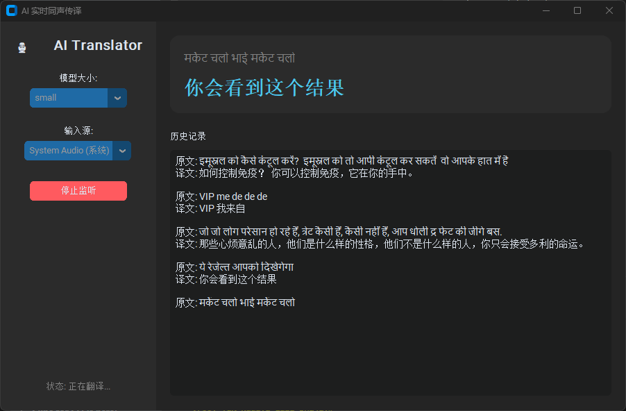

# 🎙️ AI Real-time Translator (AI 实时同声传译)



一个基于 Python 的高性能实时同声传译工具。支持**监听电脑系统声音**（如会议、电影、YouTube）或**麦克风输入**，利用 OpenAI 的 Whisper 模型进行语音识别，并实时翻译成目标语言。

本项目拥有现代化的 **Dark Mode GUI**，支持 **NVIDIA GPU 加速**，并针对连续语音进行了断句优化。

## ✨ 核心功能

*   **🎧 系统音频内录 (Windows Loopback)**: 直接捕获电脑发出的声音，无需麦克风中转，非常适合观看生肉视频、Zoom/Teams 会议。
*   **🎙️ 麦克风监听**: 支持常规的麦克风实时翻译。
*   **🚀 GPU 加速 (CUDA)**: 集成 `faster-whisper` 和自动 CUDA 环境配置，在 NVIDIA 显卡上实现毫秒级响应。
*   **🧠 本地 LLM 支持**: 新增 **LM Studio** 支持，可使用本地大模型 (如 Llama 3, Mistral) 进行更高质量的翻译。
*   **⚡ 智能 VAD 断句**: 针对连续说话场景（如新闻、演讲）设计了动态静音检测和强制切分逻辑，告别无限等待。
*   **📺 精简模式 (Mini Mode)**: 一键切换到无边框、半透明的悬浮字幕条模式，专为看剧/上网设计，不遮挡主内容。
*   **🌏 多语言支持**: 支持源语言自动检测，**目标语言可在 UI 中实时切换** (中/英/日/韩/德/法/西/俄/印)。
*   **🎨 现代化 GUI**: 基于 `CustomTkinter` 构建，支持高分屏，美观的深色模式。

## 🛠️ 技术栈

*   **GUI**: [CustomTkinter](https://github.com/TomSchimansky/CustomTkinter)
*   **ASR (语音识别)**: [faster-whisper](https://github.com/SYSTRAN/faster-whisper) (CTranslate2)
*   **Translation**: 
    *   Google Translate API (Deep Translator)
    *   [LM Studio](https://lmstudio.ai/) (Local LLM Server)
*   **Audio**: `pyaudiowpatch` (支持 WASAPI Loopback) + `scipy` (重采样)

## 📦 安装指南

### 1. 环境要求
*   Windows 10/11 (系统内录功能依赖 WASAPI)
*   Python 3.8+
*   **FFmpeg** (必须安装)
*   NVIDIA 显卡 (推荐，用于 GPU 加速)

### 2. 安装 FFmpeg
Whisper 依赖 FFmpeg 处理音频。在 PowerShell 中运行：
```powershell
winget install Gyan.FFmpeg
# 安装后请重启终端或电脑以生效
```

### 3. 克隆与安装依赖
```powershell
git clone https://github.com/your-username/translator.git
cd translator

# 创建虚拟环境
python -m venv venv
.\venv\Scripts\Activate.ps1

# 安装依赖 (会自动安装 CUDA 相关的 Python 库)
pip install -r requirements.txt
pip install customtkinter pyaudiowpatch faster-whisper deep-translator scipy colorama soundfile numpy
# 或者直接安装 NVIDIA 库以确保 GPU 可用
pip install nvidia-cublas-cu12 nvidia-cudnn-cu12
```

## 🚀 使用方法

### 启动 GUI
```powershell
python gui.py
```

### 操作指南
1.  **模型大小**: 
    *   `tiny/base`: 速度极快，精度一般。
    *   `small/medium`: 推荐，速度与精度平衡（截图中使用的是 small）。
    *   `large-v3`: 精度最高，但需要较好的显卡 (8GB+ VRAM)。
2.  **输入源**:
    *   `System Audio (系统)`: 录制电脑正在播放的声音。
    *   `Microphone (麦克风)`: 录制你的声音。
3.  **目标语言 (Target)**:
    *   在下拉菜单中选择你希望翻译成的语言（支持中文、英语、日语等）。
4.  **翻译服务 (Service)**:
    *   `Google Translate`: 免费、稳定，无需额外配置。
    *   `LM Studio`: 连接本地运行的 LLM 服务器。需先启动 LM Studio 并开启 Server 模式 (默认端口 1234)。
5.  点击 **"启动监听"** 即可开始。

> **首次运行提示**: 第一次选择某个模型时，程序会自动从 HuggingFace 下载模型权重，界面可能会短暂显示“加载中”，请耐心等待。

## ⚙️ 常见问题 (FAQ)

**Q: 为什么显示 "使用计算设备: cpu"？**
A: 请确保你安装了 NVIDIA 显卡驱动。本项目内置了自动查找 `nvidia-cudnn` 库的逻辑，通常无需手动配置 CUDA 环境变量。如果依然失败，请检查 `pip list` 是否包含 `nvidia-cudnn-cu12`。

**Q: 翻译有延迟？**
A: 
1. 确保使用了 GPU 加速。
2. 尝试使用更小的模型（如 `small` 代替 `medium`）。
3. 程序内置了 8秒 强制断句逻辑，连续说话时会有轻微缓冲是正常的。

**Q: 报错 `[Errno -9997] Invalid sample rate`?**
A: 本项目已内置自动重采样算法 (`scipy.signal.resample`)，会自动将系统音频（通常 48kHz）转换为 Whisper 需要的 16kHz。如果报错，请确保没有其他程序独占音频设备。

## 📜 许可证

MIT License
