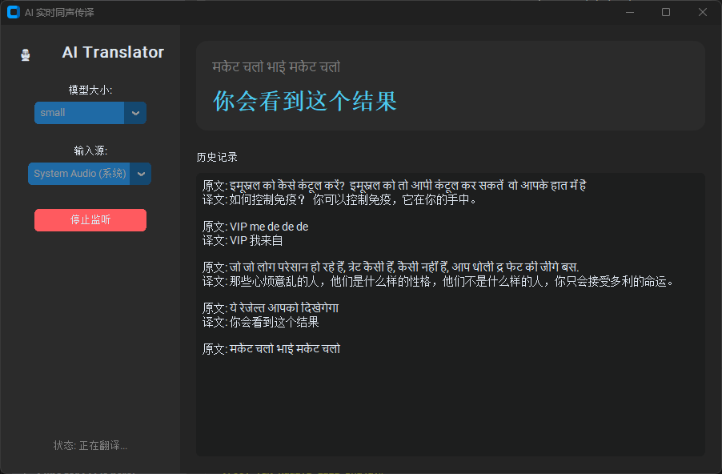

# System Audio Translator

Real-time speech recognition and translation for Windows system audio and microphone input.

[](https://github.com/icenturyw/system-audio-translator/actions/workflows/ci.yml)
[](LICENSE)



System Audio Translator captures audio from the current Windows playback device through WASAPI loopback, transcribes it with `faster-whisper`, and translates the recognized speech into a target language. It is designed for meetings, livestreams, videos, courses, and local-first workflows where users want subtitles without routing audio through a microphone.

## Why This Project Matters

Most real-time translation tools either require paid cloud services, browser-only capture, or microphone-based workarounds. This project focuses on a practical open-source desktop workflow:

- Direct system-audio capture on Windows through WASAPI loopback.
- Local speech recognition with Whisper-compatible models.
- Optional local LLM translation through LM Studio.
- A GUI that can be reduced to a compact subtitle overlay.
- A command-line entry point for debugging and automation.

The project is especially useful for developers, students, stream viewers, meeting participants, and multilingual teams who need a hackable translator that can run locally.

## Features

- Windows system-audio capture through `pyaudiowpatch` WASAPI loopback.
- Microphone capture for live conversations.
- `faster-whisper` transcription with CPU fallback and CUDA acceleration when available.
- Google Translate support through `deep-translator`.
- LM Studio support for local LLM translation.
- Translation context field for domain-specific prompts, such as movies, medical talks, or technical lectures.
- Voice activity detection and forced sentence splitting for long continuous speech.
- Streaming interim subtitles before a sentence is finalized.
- CustomTkinter dark-mode GUI with always-on-top and mini subtitle mode.
- PyInstaller build helper for packaging a Windows desktop app.

## Project Status

This is an active early-stage open-source project. The current focus is to make the Windows desktop workflow reliable, document maintenance practices, and add lightweight tests/CI around the parts that do not require live audio hardware.

Roadmap:

- Add automated tests for translator payload construction and configuration handling.
- Add a provider interface for OpenAI-compatible translation endpoints.
- Add release artifacts for Windows users.
- Improve device selection and diagnostics for multi-output audio setups.
- Add issue triage labels and a reproducible bug-report flow.

For maintainers and reviewers, see [MAINTAINERS.md](MAINTAINERS.md) and [docs/openai-codex-oss-application.md](docs/openai-codex-oss-application.md).

## Requirements

- Windows 10 or Windows 11.
- Python 3.8 or newer.
- FFmpeg available on `PATH`.
- NVIDIA GPU is optional but recommended for lower latency.

Install FFmpeg with Windows Package Manager:

```powershell
winget install Gyan.FFmpeg
```

Restart the terminal after installation so `ffmpeg` is visible on `PATH`.

## Installation

```powershell
git clone https://github.com/icenturyw/system-audio-translator.git
cd system-audio-translator

python -m venv venv
.\venv\Scripts\Activate.ps1

python -m pip install --upgrade pip
pip install -r requirements.txt
```

For NVIDIA acceleration, install the CUDA runtime wheels used by CTranslate2:

```powershell
pip install nvidia-cublas-cu12 nvidia-cudnn-cu12
```

## Usage

Start the GUI:

```powershell
python gui.py
```

Start the CLI with microphone input:

```powershell
python main.py --model small --target zh-CN
```

Start the CLI with system-audio capture:

```powershell
python main.py --system --model small --target zh-CN
```

Use LM Studio instead of Google Translate:

```powershell
python main.py --system --api lm_studio --lm_url http://localhost:1234 --lm_model local-model
```

## GUI Workflow

1. Choose a Whisper model size. `small` is a good default for quality and speed.
2. Choose `System Audio` for speaker playback or `Microphone` for direct voice input.
3. Choose the target language.
4. Choose `Google Translate` or `LM Studio`.
5. Click `Start Listening`.
6. Use mini mode when you want a compact always-on-top subtitle overlay.

## Development

Run a syntax check without needing audio devices or model downloads:

```powershell
python -m py_compile gui.py main.py translator_core.py build.py check_hostapis.py debug_audio.py
```

Run the local build helper:

```powershell
pip install pyinstaller
python build.py
```

The packaged app is written to `dist/AI_Translator`.

## Repository Structure

```text
.
├── gui.py                 # CustomTkinter desktop UI
├── main.py                # CLI translator entry point
├── translator_core.py     # Shared GUI translation engine
├── build.py               # PyInstaller packaging helper
├── check_hostapis.py      # Audio host API diagnostics
├── debug_audio.py         # Audio backend diagnostics
├── requirements.txt       # Runtime dependencies
└── example.png            # Screenshot used by the README
```

## Troubleshooting

If the app runs on CPU, check that your NVIDIA driver is installed and that the CUDA runtime wheels are available:

```powershell
pip list | findstr nvidia
```

If FFmpeg is missing, install it and restart the terminal:

```powershell
winget install Gyan.FFmpeg
```

If system-audio capture fails, run:

```powershell
python check_hostapis.py
python debug_audio.py
```

If LM Studio translation fails, confirm that the local server is running and exposes an OpenAI-compatible `/v1/chat/completions` endpoint.

## Contributing

Bug reports, device compatibility notes, documentation improvements, and provider integrations are welcome. See [CONTRIBUTING.md](CONTRIBUTING.md) for setup and contribution guidelines.

## Security

Please report security issues privately. See [SECURITY.md](SECURITY.md).

## License

MIT License. See [LICENSE](LICENSE).
